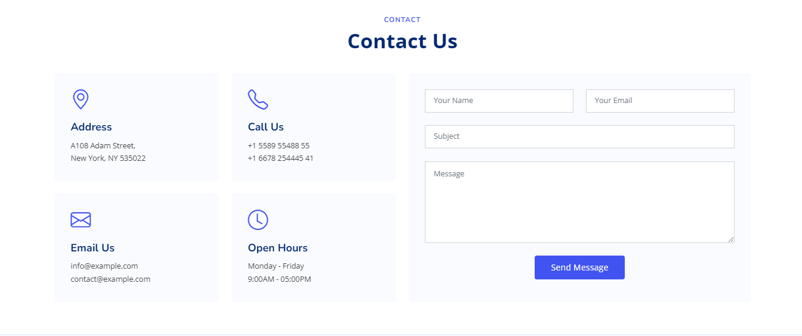
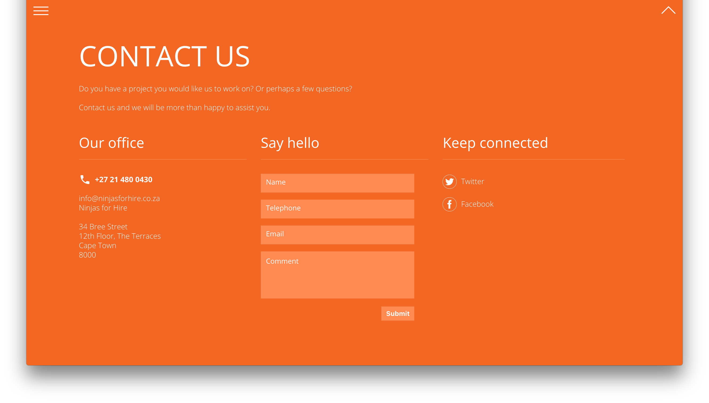

Create the above design using your favourite libraries.
 The website footer is the section of content at the very bottom of a web page. It typically contains a copyright notice, link to a privacy policy, sitemap, logo, contact information, social media icons, and an email sign-up form.
 You can add the following functionalities and refer to the template for reference.